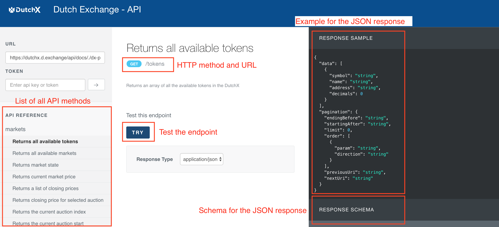
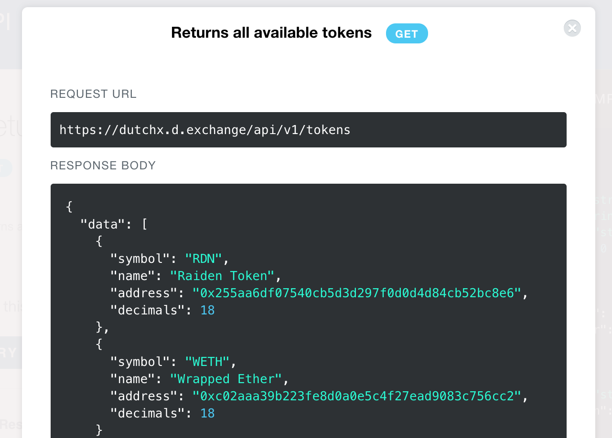

# Public API
The API is an alternative and easier way to access the information on
the smart contracts.

It was built to make the information more accessible, so it hides the barriers
that a newcomer to Ethereum development may find.

The API is accessible for:
  * **Mainnet**: [https://dutchx.d.exchange/api](https://dutchx.d.exchange/api)
  * **Rinkeby**: [https://dutchx-rinkeby.d.exchange/api](https://dutchx-rinkeby.d.exchange/api)

The API provides a simple way to browse over all methods:

You can also use the **TRY** button to test the endpoint:

  

The API is Open Source, so anyone can run it in its own server.

It provides read-only access. For any operation that needs to write in the
blockchain, you'll need to execute it using your own node (or infura). Checkout
how to do this by reading [Build on top of the Dutch Exchange](./dev-truffle.html)

The API logic is implemented in the [DutchX Services](https://github.com/gnosis/dx-services),
for more information checkout [DutchX as an open platform](./dutchx-as-an-open-platform.html)

For developers, it should be very easy to get information form the API, check
out these examples
[DutchX Example: How to use the API](https://github.com/gnosis/dx-examples-api)
project.
