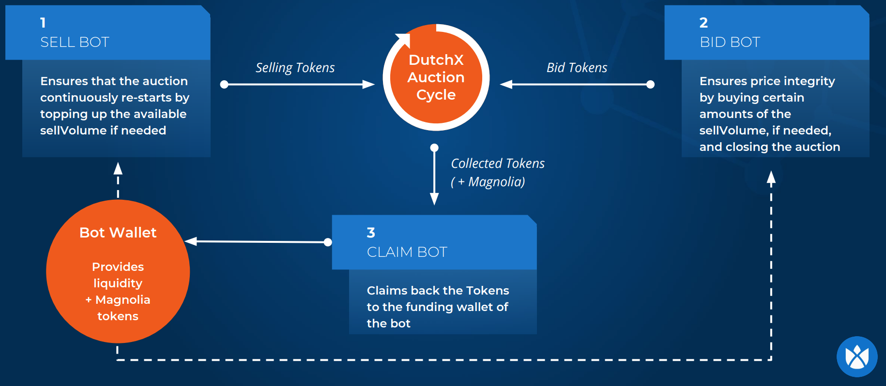
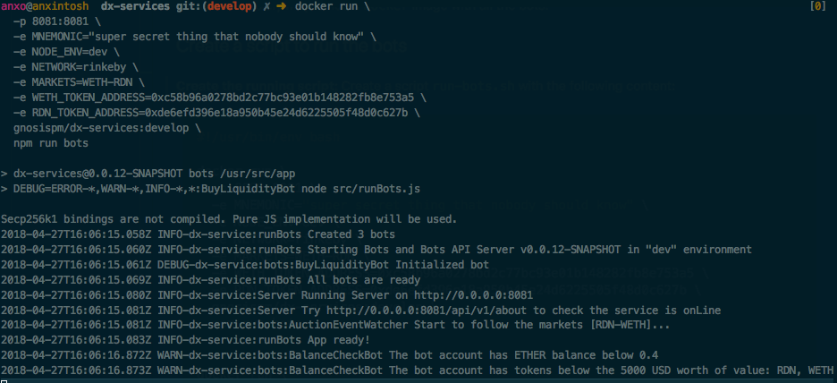
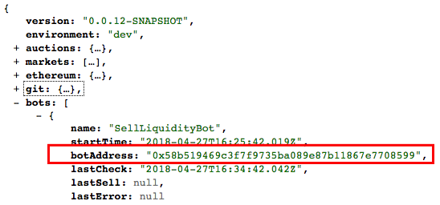
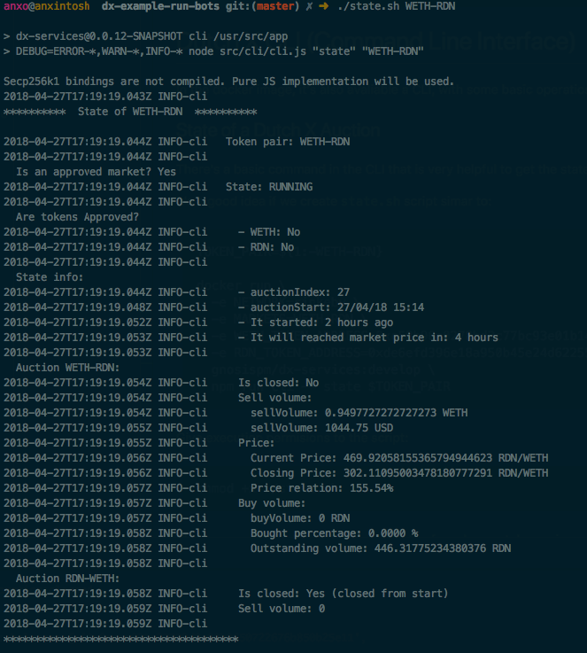

# Run your own bots on the DutchX
Bots are series of small applications that run in the background and have a
scoped task to fulfill.

They interact with the DutchX performing some operations.

For example, **liquidity bots** watch some markets and provide liquidity to ensure
that auctions run continuously and prices don't drop below the market price.

Running bots is important for markets where there's insufficient volume or a
market maker in place.



Bots are implemented in the
[DutchX Services](https://github.com/gnosis/dx-services) project and are Open
Source for anyone to use, modify, or improve.

## How to run the bots

In this guide we will show how to run the DutchX bots to ensure liquidity for any
ERC20 token pair list.

To make it easier, we provide a `Docker` image with all the **bots** and the
[**CLI**](./cli.html).

Follow through this document to run your own bots and learn how to operate on
the DutchX.

If you follow through, you'll get:

* The liquidity bots, up and running
* You'll known how to fund them so they can operate
* You'll learn how to use the CLI (command line interface)
    * To check the state of the auctions
    * To interact with the DX: Claim, buy, sell, etc.

An easy way to run the bots is to use [dx-tools](https://github.com/gnosis/dx-tools)

### 1. Create the config file for the bots

Create a config file for the bots, like the one in
[conf/bots-conf.js.example](https://github.com/gnosis/dx-tools/blob/master/conf/bots-conf.js.example), where:

* `MARKETS`: List of the ERC20 token pairs you want the bots to watch.
  * Format: `<token1>-<token2>[,<tokenN>-<tokenM>]*`
  * Example: `WETH-RDN,WETH-OMG`
  * It's important that for every distinct token provided, you also provide the
  address, the can be passed either in the config file or as ENV_VAR:
  * **WETH_TOKEN_ADDRESS**: `0xc58b96a0278bd2c77bc93e01b148282fb8e753a5`
  * **RDN_TOKEN_ADDRESS**: `0x3615757011112560521536258c1e7325ae3b48ae`
  * **OMG_TOKEN_ADDRESS**: `0x00df91984582e6e96288307e9c2f20b38c8fece9`
* `TOKENS`: List of the ERC20 tokens to be used with the bots.
  * This list is handful to configure the `BALANCE_CHECK_BOT` and `DEPOSIT_BOT`
* `MAIN_BOT_ACCOUNT`:
  * Select the main bot account (account index of the ones generated from the `MNEMONIC`)
  * The main bot account that will be used to generate reports
* `PRICE_REPO`: You can configure which external price feeds to use. You can get more information [here](./bot-types.html#)
* `BOTS`: a list of bots to be created. Can contain one or more of the following. Any bot can be disabled by not adding it to this list.
  * `BUY_BOT`: [Configuration for buying bot](./bot-types.html#)
  * `SELL_BOT`: [Configuration for selling bot](./bot-types.html#)
  * `BALANCE_CHECK_BOT`: [Configuration for balance check bot](./bot-types.html#)
  * `HIGH_SELL_VOLUME_BOT`: [Configuration for high sell volume bot](./bot-types.html#)
  * `WATCH_EVENTS_BOT`: [Configuration for watch events bot](./bot-types.html#)
  * `DEPOSIT_BOT`: [Configuration for deposit Bot](./bot-types.html#)

WARNING: When creating a new configuration file you may name it as you wish,
but make sure you update
[base-bots.sh](https://github.com/gnosis/dx-tools/blob/master/util/base-bots.sh#L13)
in order to use your own configuration.


### 2. Run the Bots

You should consider fill this environment variables with your own configuration

* `MNEMONIC`:
  * Use your secret BIP39 mnemonic.
  * The bot address will be the first
account generated by that mnemonic.
* `ETHEREUM_RPC_URL`:
  * Url for a Ethereum node
  * You can use your own node or setup infura for example:
  `https://rinkeby.infura.io`
* `NODE_ENV`:
  * Optional, `local` is the default
  * Can be one of the following: `local`, `dev`, `pre` or `pro`

We provide three scripts in order to launch your bots. Once configured correctly
you can simply run:
```bash
# Rinkeby
./bots/bots-rinkeby

# Kovan
./bots/bots-kovan

# Mainnet
./bots/bots-mainnet
```

When you run it for the first time, you should see something similar to:



Don't worry for now about the **WARN** message shown at the bottom, we'll deal
with it in the **Fund the bots** section.

This script will:

* Start **3** bots that will ensure the liquidity: `SellLiquidityBot`,
`BuyLiquidityBot` and `BalanceBot` (more info about these bots in
[DutchX Bots](./bots-types)
)
* Runs a simple API server that exposes basic information:
[http://localhost:8081]()

## Fund the bots

The bots automatically participate in the auctions performing bids and asks when
the time is right.

In order to do this bids and asks, they need to have a balance in the `DutchX`
smart contract.

For founding the bots, we need to know their Ethereum address, this is
determined by the secret mnemonic you've used to run the bots.

An easy way to know the address is just to visit the about endpoint:

* [http://localhost:8081]()

You should see among other information, the accounts used by the bots:



Once you have the **bot account**, your **secret mnemonic** and the
**bots running**, you are all set for the funding.

> The easiest way is to use the **DutchX CLI**.
>
> Check out the **Deposit** section in [this guide](./cli.html#deposit-tokens)

## DutchX CLI (Command Line Interface)

In the docker image, it's also available a CLI, with some basic operations for
using the DutchX.

You can use it for getting the state of a token pair, or to trade in an auction
among other things.

> Checkout the CLI documentation to learn how to use it.
> * [Trading commands for the CLI](./cli.html#start-trading)

This sample project also provides a simple [CLI script](./cli) you can use.

### State of a DutchX Auction
There's a basic command in the CLI that is very helpful to get the state of the
auctions.

**Example: Get the state of the WETH-RDN auction**
```bash
./cli state WETH-RDN
```

We would get something similar to:




> For other methods, or to learn how to use the CLI go to:
> * [DutchX Cli page](./cli.html)

## DutchX Bots
There are 6 bots:

* `SellLiquidityBot`
* `BuyLiquidityBot`
* `BalanceCheckBot`
* `HighSellVolumeBot`
* `WatchEventsBot`
* `DepositBot`

Find out more about them in:
* [DutchX Bots page](./bots-types.html)

## Debug
To increase the debug level, you can change the bot script to run with
`run bots-dev` instead of `run bots`.

> Don't forget to change it back for the production script.

## Next steps
You may be also interested in:
* [Add a price feed for your bots](./bots-price-feed.html)
* [DutchX as an open protocol](./dutchx-as-an-open-protocol.html)
* [Add a token pair](./add-token-pair.html)
* [API](./api.html)
* [CLI](./cli.html)
