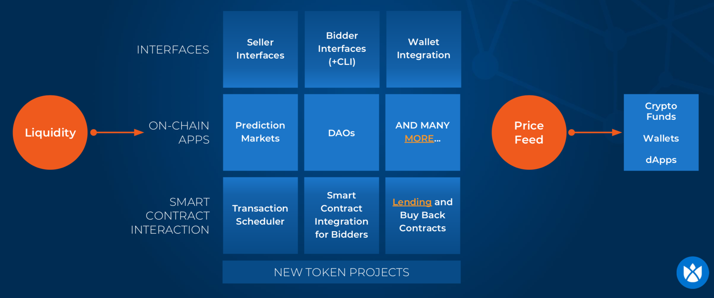

# DutchX as an open protocol
The DutchX is **100% open source** and has been built as a community effort to improve
the problems that current centralized and decentralized platforms face.

The DutchX is an ecosystem of interfaces, on chain apps, and smart contracts that
create a common liquidity pool that all users can benefit from.

## Smart contracts
The core of the project is the Smart Contracts, which hold the logic described in
the [Smart Contract Documentation](./smart-contract-documentation.html), and
can be found in [https://github.com/gnosis/dx-contracts](https://github.com/gnosis/dx-contracts)

The smart contracts are the base of this open protocol, and anyone can build
tools, applications and interfaces on top of them, making the DutchX a unique and
fair protocol to exchange tokens.

The main contracts are:
* [**DutchExchange.sol**](https://github.com/gnosis/dx-contracts/blob/master/contracts/DutchExchange.sol):
This contract contains all the Dutch Auction mechanisms. It includes the
logic for adding a new token pair, posting a sell order, or a buy order.
* [**DutchExchangeProxy.sol**](https://github.com/gnosis/dx-contracts/blob/master/contracts/DutchExchangeProxy.sol):
This contract acts as an intermediary between the users and the core contract.
This contract is the one holding the data of the DutchX, so it's the one we should
use to interact with the DutchX. Please, read more about the Proxy Pattern for
Smart Contracts in this <a href="https://blog.gnosis.pm/solidity-delegateproxy-contracts-e09957d0f201" target="_blank">Solidity DelegateProxy</a> post.

Security was the main focus on the design and implementation of the DutchX.
Check out this [Security in DutchX](./security-of-the-contracts.html) document for more information.

## Services, API, Bots and CLI
Another important piece of the DutchX is the [DutchX services](https://github.com/gnosis/dx-services) project.

This project uses the smart contract as a base layer, and builds some
 repositories, services and utilities on top of it.

This project may be split into different smaller ones in the future.

It has the following parts:
* **Repositories**: Abstraction on top of the smart contracts to make it easier
to interact with them. For example, they add the same validations that are going
to be performed in the smart contract, so they can throw more meaningful errors,
instead of the `revert` that smart contracts throw by default.
* **Services**: Some use cases built on top of the DutchX. The CLI, Bots and API
 use this layer to perform all its tasks.
* **API**: REST Api that provides a simpler access to the data in the DutchX.
Check out the [API documentation](./api.html)
* **CLI**: The Command Line Interface is a very useful tool to invoke some
operations in the smart contracts such as posting sell/buy orders, and
extracting information from them (for example getting the status of a token
pair).
It can be used in test nets like `rinkeby` or in `mainnet`.
Learn more about the [CLI](./cli.html) page.
* **Bots**: The bots are a series of small applications that run in the background
and have a scoped task to fulfill. They interact with the DutchX performing some
operations. For example the liquidity bots watch some markets and provide
liquidity, ensuring that auctions run continuously and that prices don't drop below
market price. Learn more about bots in the following guide.
[Run your own bots](./bots-market-making.html)

## Contribute
The community is what makes the DutchX great.

Become part of it and contribute to create new interfaces, improve tools,
and spread the word.

Meet the community on Github and our [Gitter channel](https://gitter.im/gnosis/DutchX).
