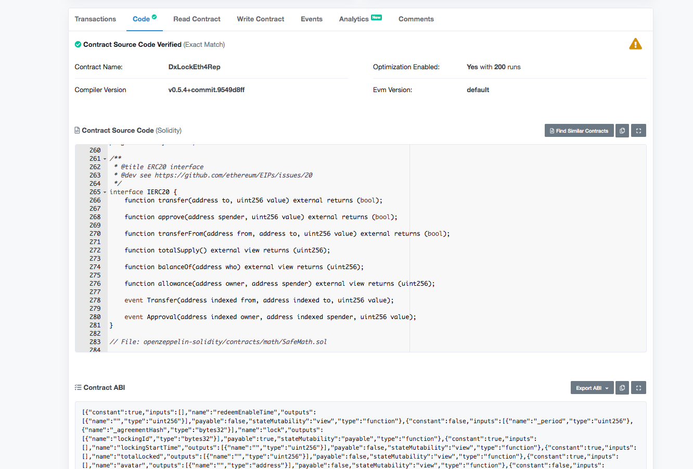
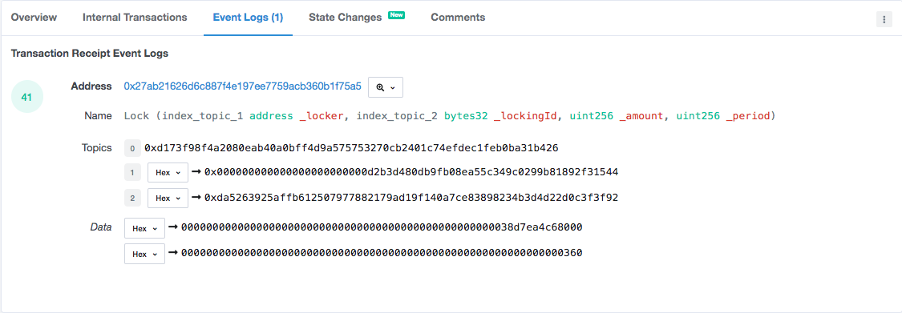

# Participating in the dxDAO staking period directly using ABI tools

If you are using a smart contract multisig or some other contract to participate in the dxDAO, maybe your only way to go is creating the transactions "manually", here you will find how to do it so.

This guide expects that you already read all materials linked in [the previous section](dxDAO) and that you have understanding of the different staking percentages, ways to participate.

## NOTE: 
While doing this step you automatically sign our participation agreement. Please read it carefully before continuing:  	https://ipfs.io/ipfs/QmRQhXUKKfUCgsAf5jre18T3bz5921fSfvnZCB5rR8mCKj
* **THE PARTICIPATION AGREEMENT INCLUDES THE TERMS OF PARTICIPATION IN THE DXDAO.**
* **THE PARTICIPATION AGREEMENT IS CRYPTOGRAPHICALLY HASHED BY EVERY TRANSACTION YOU SUBMIT ON THE ETHEREUM BLOCKCHAIN WHETHER VIA THE INTERFACE OR BY DIRECT INTERACTION WITH THE RESPECTIVE SMART CONTRACTS IN THE VOTE STAKING PERIOD (AS DEFINED IN THE AGREEMENT).** 
### By signing your transaction, you confirm that:
**any such hash shall constitute conclusive evidence of your intent to be bound by this participation agreement and you waive any right to claim otherwise or to argue against its admissibility or authenticity in any legal proceedings;
you have read, fully understood, and accept all the terms contained in the participation agreement.**


Contract Addresses:
* [DxLockEth4Rep](https://etherscan.io/address/0x4564BFe303900178578769b2D76B1a13533E5fd5#contracts): 0x4564BFe303900178578769b2D76B1a13533E5fd5
* [DxLockWhitelisted4Rep](https://etherscan.io/address/0x1cb5B2BB4030220ad5417229A7A1E3c373cDD2F6#contracts): 0x1cb5B2BB4030220ad5417229A7A1E3c373cDD2F6
* [DxLockMgnForRep](https://etherscan.io/address/0x2e6fae82c77e1d6433ccaaaf90281523b99d0d0a#contracts): 0x2E6FaE82c77e1D6433CCaAaF90281523b99D0D0a
* [DxGenAuction4Rep](https://etherscan.io/address/0x4d8db062defa0254d00a44aa1602c30594e47b12#contracts): 0x4D8DB062dEFa0254d00a44aA1602C30594e47B12

dxDAO Agreement document:
- Link: https://ipfs.io/ipfs/QmRQhXUKKfUCgsAf5jre18T3bz5921fSfvnZCB5rR8mCKj
- hash: 0x2d9c919cecf0e19b7717a86747f703d8cf0f9ffd98e4e8a13638b1a92ef0b25a

### How can you verify that the agreement hash is correct? 

You can retrieve the agreement via IPFS. Please note that IPFS uses a different encoding (Base68).
You can convert this hash into the propper IPFS hash here: https://incoherency.co.uk/base58/
Note that you have to add the prefix "1220"
 
The 12 describes the hashing algo: https://github.com/multiformats/go-multihash/blob/master/multihash.go#L41
and tje 20 indicates the length. This is why usually IPFS hashes start with "Qm"

QmRQhXUKKfUCgsAf5jre18T3bz5921fSfvnZCB5rR8mCKj (base58) =>
12202d9c919cecf0e19b7717a86747f703d8cf0f9ffd98e4e8a13638b1a92ef0b25a (hex) => without prefix:
0x2d9c919cecf0e19b7717a86747f703d8cf0f9ffd98e4e8a13638b1a92ef0b25a


## 1. Staking Ether.
In this method you will participate using Ether directly, not WETH.
The Smart Contract used is https://etherscan.io/address/0x4564BFe303900178578769b2D76B1a13533E5fd5#contracts and you can find there the code and also the ABI, just below the smart contract code.



The Ether staking contract has two main methods: lock and release. You need to first lock your ETH for a period of time X and when that period is over, release the ETH to your account.

This is the lock method: 
```js
lock(uint256 _period, bytes32 _agreementHash)
```
There are two parameters:
* Period: The amount of time to lock the ETH in the contract (in seconds).
* AgreementHash: The hash of the dxDAO agreement document.

There is a 3rd parameter that is implicit in the transaction, the ETH sent.

So, for staking with ETH, choose your favourite tool to create the transactions ([MEW](https://www.myetherwallet.com/), [Mycrypto](https://mycrypto.com/), [Gnosis Multisig](https://wallet.gnosis.pm/#/wallets)) and initiate a new smart contract interaction.

* **MEW**: Access my wallet > Contract > Interact with contract.
* **Mycrypto**: Tools > Interact with Contracts 
* **Gnosis Multisig**: Click on your Multisig > Multisig transactions add.

### Steps
1. In the to/destination field, enter to DxLockEth4Rep smartcontract address.

2. Paste the ABI

3. A dropdown appears with all the smart contract methods.

4. Select the method `lock``

5. Enter desired period (in seconds)
Some example periods are:
   * 1 day: 86400
   * 1 week: 604800
   * 30 days: 18144000
6. Enter the hash of the agreement document. (Link to post where it's shown)

7. Enter the ETH value for the locking.

8. Sign and submit transaction.

After compleating these steps and the transactions is mined, you are now part of the staking of dxDAO, but will want to get back your Ether when the staking period is over, for that you will the a parameter called lockingId. You can get this, by clicking on the transaction receipt and going to the events section in Etherscan. 



In this screenshot, you can see lockingId is the indexed topic with index 2, that's `0xda52...`

When your locking period is over, you will be able to release the ETH through the release function.
```js
release(address _beneficiary, bytes32 _lockingId)
```
* **beneficiary**: The ethereum address that will receive your ETH.
* **lockingId**: The ID for the locking, you obtained in the event detailed above.


Follow the same steps as before 1-3.

4. Select method `release`

5. Enter beneficiary, usually your account address/multisig.

6. Enter the locking ID.

7. Sign and send transaction.

8. ETH should be in your beneficiary address now if the locking period was over.

## 2. Register MGN
Magnolia (MGN) holders can also obtain dxDAO reputation by registering for MGN staking. For this, you need to call the DxLockMgnForRep contract and register the address that holds or will hold MGN at the end of the stacking period. After the staking period is over, you can redeem the dxDAO reputation tokens an ethereum address you pass as parameter.

The two functions involved are:
1. `register(bytes32 _agreementHash)`
2. `claim(address _beneficiary, bytes32 _agreementHash)`

### Steps
1. Enter as to/destination the smart contract address of DxLockMgnForRep.
2. Paste the ABI.
3. Select method `register``
4. Enter the dxDAO Document Agreement Hash
5. Sign and send transaction.

Now if the transaction was succesful the wallet you used will take part in the staking with MGN.

After the staking period is over, you can claim your REP, follow same step 1-2.

3. Select method `claim`
4. Enter benificiary, usally your same account/multisig.
5. Enter the dxDAO Document Agreement Hash
6. Sign and send transaction.

If the transaction was succesful, you should have the Reputation tokens in the beneficiary ethereum address.

## 3. Staking Tokens.
For participating in the staking using Tokens, first you need to use a token that is accepted in the dxDAO. After that, an ERC20 token approval has to be made to allow the staking contract (DxLockWhitelisted4Rep) to lock your tokens. Finally, last but not least, trigger the locking function. 

The functions involved in the process are:
1. `lock(uint256 _amount, uint256 _period, address _token, bytes32 _agreementHash)`
    * amount: Amount of tokens used in the locking (note that should be the full value/wei)
    * period: Duration of locking in seconds.
    * token: ERC20 token address.
    * agreementHash: dxDAO agreement document hash.
2. `release(address _beneficiary, bytes32 _lockingId)`

### Steps:
1. Enter as to/destination the smart contract address of DxLockWhitelisted4Rep.
2. Paste the ABI.
3. Select method `lock`
4. Enter amount of tokens with decimals as offset: e.g 1 DAI -> 1e18 DAI
5. Enter the period of locking in seconds. (Same as stacking ETH)
6. Enter the token you want to use for locking (Only tokens with enough liquidity are allowed to be used for staking, please verify before hand in the main dxDAO stacking interface that the token you want to use is going to work)
7. Enter the dxDAO Document Agreement Hash
8. Sign and send transaction.

The locking generates an Ethereum event where the lockingID can be seen and used for the release of the tokens, after the locking period you set is over.

#### For releasing: 
1. Enter as to/destination the smart contract address of DxLockWhitelisted4Rep.
2. Paste the ABI.
3. Select method `release`
4. Enter beneficiary address. Usually the same address you used for locking.
5. Enter the dxDAO Document Agreement Hash
6. Sign and send transaction.

## 4. GEN Auctions.
The 4th method to get Reputation in the dxDAO during the staking period is to participate in the GEN auction that will take place. For that end, you need to hold GEN and allow the Auction4Reputation contract to use your GEN tokens.

The functions involved in the process are:
1. `bid(uint256 _amount, uint256 _auctionId)`

# Steps:
1. Enter as to/destination the smart contract address of Auction4Reputation.
2. Paste the ABI.
3. Select method `bid`
4. Enter amount of GEN with decimal offset: e.g 1 Token of GEN -> 1e18 GEN
5. Enter the auctionId you want to participate in. Check what's the current one in the dxDAO website.
6. Sign and send transaction.
